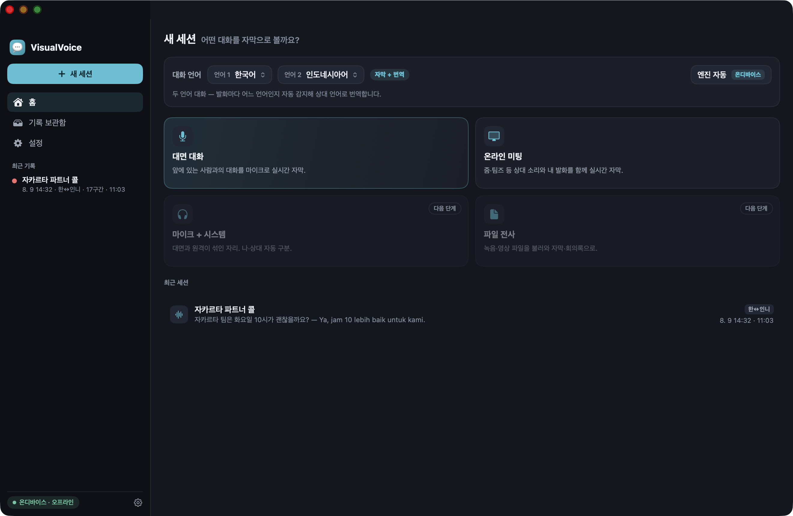
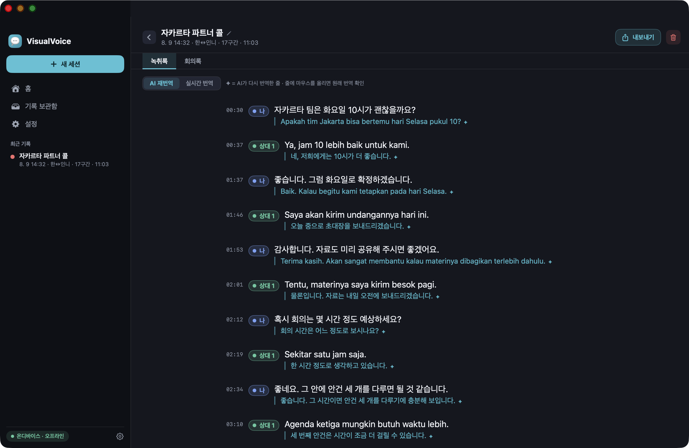
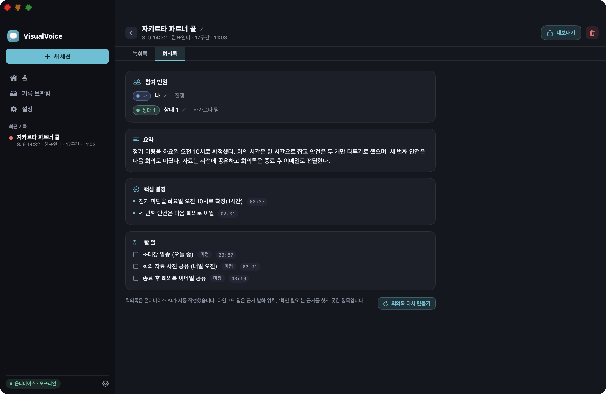

# VisualVoice

> 청각장애가 있는 비즈니스 사용자를 위한 macOS **온디바이스 실시간 자막 · 녹취 · 회의록 · 실시간 번역** 통합 앱


VisualVoice는 **앞에 있는 사람의 말(마이크)** 과 **온라인 미팅의 소리(시스템 오디오)** 를 실시간 자막으로 보여주고, 한국어·영어·인도네시아어를 발화마다 자동 감지해 상대 언어로 번역하며, 세션이 끝나면 회의록을 자동으로 작성합니다. Mac 기본 실시간 자막과 별도의 녹취 앱을 번갈아 쓰던 두 흐름을 한 창에 합치고 번역을 더한 것이 출발점입니다.

**전 과정이 기기 안에서 끝납니다.** 음성·자막·번역·회의록 어느 것도 서버로 보내지 않고, 최초 1회 언어팩·모델을 내려받은 뒤에는 완전 오프라인으로 동작합니다.

> ⚠️ **개인 프로젝트입니다.** 자체 서명 로컬 빌드 전용이며(공증·배포 없음), 텔레메트리와 개인 정보 수집이 없습니다.

---

## 🖥 화면

**홈** — 언어 두 개를 고르고 대화 방식을 누르면 시작합니다. 두 언어가 다르면 자동으로 번역이 켜집니다.



**녹취록** — `나` / `상대 N` 화자 칩, 원문 아래 번역. `AI 재번역` ↔ `실시간 번역` 토글로 두 번역을 비교하고, ✦ 가 붙은 줄에 마우스를 올리면 원래 실시간 번역이 보입니다.



**회의록** — 세션을 정지하면 온디바이스 AI가 요약·핵심 결정·할 일·참여 인원을 작성합니다. 각 항목의 타임코드 칩을 누르면 근거가 된 발화로 이동하고, 근거를 찾지 못한 항목에는 `확인 필요` 배지가 붙습니다.



> 위 화면의 대화 내용은 **기능을 보여주기 위해 지어낸 예시**입니다. 실제 사용 기록이 아닙니다.

---

## 🚀 빠른 시작

배포용 바이너리는 없습니다. 직접 빌드해서 씁니다 — **macOS 26 이상 · Apple Silicon · Xcode 26 이상**이 필요합니다.

```bash
git clone https://github.com/LimMinGue/VisualVoice.git
cd VisualVoice
VV_SIGN_IDENTITY="-" ./build.sh -i -r   # Release 빌드 → /Applications 설치 → 실행
```

> ⚠️ **`VV_SIGN_IDENTITY="-"` 를 빼면 빌드가 실패합니다.** 프로젝트에는 개발자 본인의 자체 서명 인증서 이름(`LimMinGue`)이 기본값으로 들어 있어, 그 인증서가 없는 다른 기기에서는 서명 단계에서 멈춥니다. `"-"` 는 ad-hoc 서명(서명 신원 없음)이라 로컬 실행에 충분합니다. 본인 인증서가 있다면 그 이름을 넣으세요 — 서명 신원이 일정해야 macOS가 같은 앱으로 인식해 재빌드할 때마다 권한을 다시 묻지 않습니다.

처음 실행하면 **온보딩 3단계**가 뜹니다: 환영 → 권한 안내(마이크) → 언어팩 준비. 각 단계는 건너뛸 수 있고, 건너뛰면 필요한 시점에 자동으로 요청합니다.

그다음은 홈에서 **언어 1 · 언어 2를 고르고 → 대화 방식 타일을 누르면** 자막이 시작됩니다. 자세한 절차는 [사용법](#-사용법), 빌드 옵션·모델 준비·권한은 [빌드 & 설치](#️-빌드--설치)를 보세요.

---

## ✨ 주요 기능

### 실시간 자막
- 🎙 **대면 대화** — 마이크로 앞사람과의 대화를 실시간 자막
- 🖥 **온라인 미팅** — 줌·팀즈 등 **상대 소리(시스템 오디오)와 내 마이크를 동시에** 캡처. 내 발화는 항상 `나`로 기록되고, 상태바의 **내 마이크** 토글로 끌 수 있습니다
- 🔀 **엔진 자동 라우팅** — 한국어·영어 = Apple SpeechTranscriber, 인도네시아어 = WhisperKit large‑v3 turbo. 전부 온디바이스
- 🌐 **언어 1 · 언어 2** — 두 언어가 같으면 자막만, 다르면 자막 + 번역. 발화마다 언어를 자동 감지해 상대 언어로 번역하며, 마지막 선택을 기억합니다
- 👥 **화자 칩** — `나` / `상대 N`, 색과 텍스트를 함께 표기(색각 대응). 불확실한 화자는 점선 칩
- 🔠 **자막 크기 70 ~ 180 %** 를 라이브 화면·팝아웃·설정 어디서나, **밀도**(간결/상세), 원문·번역 **이중 표기** 토글
- 📌 **항상‑위 자막 패널**(팝아웃) — 메인 창이 가려지거나 최소화되면 자동으로 뜨고, 돌아오면 자동으로 닫힙니다
- ⬇️ **자동 스크롤 + '새 자막 N개' 배지** — 위로 올려 읽는 동안 도착한 자막을 놓치지 않게
- ⌨️ **타이핑 발화** — 내가 친 문장을 대화 흐름에 넣고, 상대 언어로 번역해 **읽어주기**(음성 합성)로 상대에게 들려줍니다. 재생 중에는 마이크를 잠시 닫아 자기 소리가 자막이 되는 것을 막습니다
- 👁 **소리를 눈으로** — 입력 레벨 미터(온라인 미팅은 마이크·시스템 2계통), 무음 경고, 내장 스피커 사용 경고, 마이크·녹음·번역 실패 배너

### 인식 품질
- 🧠 **음성 분류 기반 전사 게이트** — 절대 음량이 아니라 "사람 말인가"로 판정해 1 m 밖 상대 발화도 잡고, 소음이 자막으로 둔갑하는 환각은 4중으로 막습니다
- 🧭 **2언어 쌍 클램프·대화 관성** — 자동 감지가 선택하지 않은 제3 언어로 새지 않습니다
- ✂️ **문장 확정 규칙** — 종결부호 인지, 무음 분절, 잘린 문장 병합, 어두 프리롤, 경계 오버랩
- 🧪 **쉼 없이 이어지는 말 조기 확정(실험)** — 두 사람이 쉼 없이 주고받을 때 앞 문장을 먼저 확정해 한 줄로 뭉치거나 언어가 섞이는 것을 줄입니다(설정 › 인식)

### 화자
- 🎯 **실시간 화자 분리**(FluidAudio) — 칩을 눌러 **나로 지정** · **숨기기**(자막만, 녹취록엔 보존)
- ✏️ **세션 상세에서 화자 재지정** — 이 줄만 / 같은 화자 전부. 직접 지정한 줄은 이후 자동 재계산이 덮지 않습니다
- 🔁 **화자 다시 인식** — 녹음 원음으로 종료 후 정밀 재계산(인원 자동 추정 또는 2~5명 지정)

### 번역
- ⚡ **실시간** — Apple Translation(문장 단위, 온디바이스)
- ✦ **AI 재번역** — 세션이 끝나면 앱에 내장된 MLX Gemma 모델이 문맥을 보며 다시 번역합니다. 실시간 번역은 지우지 않고 별도 보관 — 토글로 비교하고, 줄에 마우스를 올리면 원래 번역이 보입니다. 일부만 성공하면 "N줄 중 M줄" 로 정직하게 표기

### 회의록
- 📝 **자동 작성**(FoundationModels, 온디바이스) — 요약 · 핵심 결정 · 할 일 · 참여 인원
- 🔗 **근거 타임코드 칩** — 결정·할 일마다 근거 발화로 점프. 근거를 못 찾은 항목엔 **확인 필요** 배지가 자동으로 붙습니다
- 👤 **참여 인원 정정** — 이름을 못 맞힌 자리는 추정 역할을 보여주고 클릭해 바로 고칩니다
- 🔄 **회의록 다시 만들기** — 실패했거나 Apple Intelligence를 나중에 켠 경우. 직접 고친 이름은 유지

### 세션 · 기록
- 💾 **자동 저장** — 녹취록·회의록·번역과 함께 날짜·엔진·모델·**기록 조건**(마이크 실패, 오디오 끊김 복구 횟수, 번역 실패 줄 수 등)을 남깁니다
- 🗂 **기록 보관함** — 제목·미리보기·녹취록 원문·번역 전문 검색, 제목 인라인 편집
- 🎧 **세션 음원 녹음** — 원음과 인식 음원을 WAV로 저장(세션 삭제 시 함께 삭제, 강제 종료 시 헤더 자동 복구, 설정에 사용량 표시)
- 📜 **이 녹음 다시 전사** — 녹음 전체를 통째로 전사한 대본을 라이브 자막과 대조
- 🔤 **치환 규칙** — 인식기가 자주 틀리는 이름·브랜드·전문용어를 화면과 내보내기에서 바로잡습니다. 저장된 원문은 그대로(줄에 마우스를 올리면 원문 확인)
- 📤 **내보내기** — TXT · Markdown · PDF · DOCX · JSON, 토글: 타임코드 · 화자 라벨 · 원문+번역 · 회의록 · 녹취록 · 군말 제거 · AI 재번역

### 정직 표기 원칙
- 잠정·추정·불확실을 확정처럼 보이게 하지 않습니다(잠정 배지, 점선 칩, 확인 필요 배지, ✦ 마커)
- 실패는 침묵하지 않습니다 — 저장·번역·녹음·마이크 실패는 배너로, 세션 기록에도 남깁니다
- 없는 수치를 만들지 않습니다(예: 날짜를 알 수 없는 옛 세션은 "날짜 미상")

> **검증 상태에 대해서도 같은 원칙을 적용합니다.** 위 기능은 모두 구현·빌드를 마쳤지만, 개발자 1인의 실사용 환경에서 검증된 범위는 제한적입니다. 특히 **온라인 미팅 동시 캡처 · 원거리 음성 게이트 · 세션 음원 녹음 · 화자 다시 인식**은 합성 음원 회귀 테스트를 통과했을 뿐 다양한 실제 회의 환경에서의 검증은 진행 중입니다. iPad 타깃은 시뮬레이터 단계이며 실기기에서 확인되지 않았습니다.

---

## 📖 사용법

### 1. 대화 언어 고르기 (홈)

**언어 1 · 언어 2** 드롭다운 2개로 정합니다.

| 고른 조합 | 동작 |
|---|---|
| 두 언어가 **같음** (예: 한국어 · 한국어) | **자막만** — 번역 줄과 번역 토글이 아예 숨겨집니다. 잘 안 들리는 같은 언어 대화를 크게 보는 용도 |
| 두 언어가 **다름** (예: 한국어 · 인도네시아어) | **자막 + 번역** — 발화마다 어느 언어인지 자동 감지해 상대 언어로 번역합니다. 방향은 자동이라 바꿔 끼울 필요가 없습니다 |

고른 조합은 **기억됩니다.** 다음에 앱을 열면 마지막 선택 그대로입니다.

### 2. 대화 방식 고르기 (홈 타일)

| 타일 | 무엇을 듣는가 | 상태 |
|---|---|---|
| 🎙 **대면 대화** | 마이크 — 앞에 있는 사람과의 대화 | 사용 가능 |
| 🖥 **온라인 미팅** | 시스템 오디오(줌·팀즈 등 상대 소리) **+ 내 마이크 동시** | 사용 가능 |
| 마이크 + 시스템 | — | **다음 단계**(미구현, 타일에 표시됨) |
| 파일 전사 | — | **다음 단계**(미구현, 타일에 표시됨) |

> 온라인 미팅은 **화면 및 시스템 오디오 녹음** 권한이 필요하고, 승인 후 앱을 한 번 다시 실행해야 합니다. 소리만 쓰고 화면은 저장하지 않습니다.
> 이어폰·헤드폰을 쓰는 것을 전제로 합니다. 내장 스피커로 소리가 나면 내 발화가 중복 기록될 수 있어 경고 배너가 뜹니다.

### 3. 대화 중에 (라이브 화면)

- **읽기 조절** — 자막 크기 `A−` / `A＋`(70 ~ 180 %), 밀도(간결 ↔ 상세), 원문·번역 이중 표기 토글
- **화자 칩** — `나` / `상대 N`. 칩을 누르면 **나로 지정** 또는 **숨기기**(자막에서만 숨고 녹취록에는 남습니다)
- **⌨️ 타이핑 발화** — 말하기 어려울 때 아래 입력바에 치면 내 발화로 대화에 들어가고, 상대 언어로 번역됩니다. **읽어주기**를 누르면 상대 언어 음성으로 재생돼 상대가 들을 수 있습니다. 재생 중에는 마이크가 잠시 닫혀 자기 소리가 자막이 되지 않습니다
- **📌 패널로 띄우기** — 자막만 항상 맨 위에 뜨는 작은 창. 메인 창이 가려지거나 최소화되면 **자동으로 뜨고**, 돌아오면 자동으로 닫힙니다
- **내 마이크 토글**(온라인 미팅 전용) — 내 발화 기록을 끕니다. 끄면 "내 마이크 꺼짐"이 계속 표시됩니다
- **일시정지 / 정지** — 정지하면 세션이 저장되고 세션 상세로 넘어갑니다
- 위로 스크롤해 읽는 동안 새 자막이 오면 하단에 **'새 자막 N개 ↓'** 배지가 뜹니다

> 자막이 한 줄도 안 나온 채 정지하면 세션은 저장되지 않고, 홈에서 "말소리를 찾지 못했습니다"를 한 번 알려줍니다(녹음은 남습니다).

### 4. 대화가 끝나면 (세션 상세)

정지하는 순간 **회의록 작성 → AI 재번역**이 차례로 자동 실행됩니다.

- **녹취록** 탭 — 전체 대화. 화자 칩을 클릭해 화자를 바로잡을 수 있고("같은 화자 전부" 토글 제공), 직접 지정한 줄은 이후 자동 재계산이 덮지 않습니다
- **회의록** 탭 — 요약 · 핵심 결정 · 할 일 · 참여 인원. 각 항목의 **타임코드 칩**을 누르면 근거가 된 발화로 점프하고, 근거를 못 찾은 항목에는 **확인 필요** 배지가 붙습니다. 참여 인원 이름은 클릭해서 바로 고칩니다
- **재전사 대본** 탭 — "이 녹음 다시 전사"를 실행했을 때만 나타납니다. 라이브 자막이 놓친 말을 대조하는 용도이며 원래 녹취록은 바뀌지 않습니다
- **✦ AI 재번역** — 실시간 번역을 지우지 않고 따로 보관합니다. 상단 토글로 둘을 비교하고, 줄에 마우스를 올리면 원래 실시간 번역이 보입니다
- **녹음 파일** — 원음 · 인식 음원을 Finder에서 열 수 있습니다(녹음이 없으면 이 행 자체가 없습니다)
- **화자 다시 인식** — 녹음 원음으로 화자를 정밀 재계산합니다. 멀리서 녹음한 대면 대화는 자동 추정이 여러 사람을 한 명으로 묶을 수 있으니 **인원(2~5명)을 지정**하는 편이 정확합니다
- **내보내기** — TXT · Markdown · PDF · DOCX · JSON. 토글: 타임코드 · 화자 라벨 · 원문+번역 · 회의록 · 녹취록 · 군말 제거 · AI 재번역

### 5. 지난 기록 찾기 (기록 보관함)

제목 · 미리보기뿐 아니라 **녹취록 원문과 번역까지 전문 검색**합니다. 제목은 클릭해서 바로 고치고, 세션을 삭제하면 녹음 파일도 함께 지워집니다(삭제 확인 창에 파일 수와 용량이 표시됩니다).

**처음 설치하면 기록이 비어 있습니다.** 예제 세션을 미리 만들어 두지 않기 때문입니다 — 지어낸 기록과 실제 기록을 구분할 방법이 없으면 그 자체가 거짓 정보가 됩니다. 첫 대화를 마치면 그때부터 쌓입니다.

말소리를 한 줄도 찾지 못한 세션은 저장되지 않고, 홈에서 그 사실을 한 번 알려줍니다(녹음은 남습니다). 저장은 됐지만 녹취록이 없는 세션을 열면 예제 대화 대신 **왜 비어 있는지**를 알려주고, 녹음이 남아 있다면 `이 녹음 다시 전사`로 대본을 만들 수 있다고 안내합니다.

### 6. 설정

| 그룹 | 내용 |
|---|---|
| **표시** | 자막 크기 · 밀도 · 원문·번역 이중 표기 |
| **자막 패널** | 팝아웃 배경 불투명도 · 창 가림 시 자동 표시 |
| **인식 (실험)** | 쉼 없이 이어지는 말을 문장 단위로 먼저 확정 — 기본 꺼짐, 켜면 **다음 세션부터** 반영 |
| **녹음** | 세션 음원 저장 켜기·끄기 · 총 사용량 · Finder에서 보기 |
| **치환 규칙** | 인식기가 자주 틀리는 이름·브랜드·전문용어 등록. 화면과 내보내기에만 적용되고 **저장된 원문은 그대로**입니다 |

---

## 🧰 요구사항

- **macOS 26 (Tahoe) 이상, Apple Silicon 전용** — SpeechAnalyzer · Translation · FoundationModels · ScreenCaptureKit 오디오 캡처가 모두 26+/Apple Silicon 전용입니다. Intel Mac은 지원하지 않습니다
- **Xcode 26+** — SwiftUI. 프로젝트는 Swift 5 언어 모드로 빌드합니다(`SWIFT_VERSION = 5.0`)
- **Apple Intelligence 활성** — 회의록 작성과 실시간 번역의 고품질 전략에 사용됩니다(꺼져 있으면 사유를 표시하고 나머지 기능은 정상 동작)
- 저장 공간 — Apple 언어팩 + WhisperKit turbo 632 MB + FluidAudio 화자 모델 약 70 MB(자동 다운로드), **AI 재번역 모델 4.9 GB**(아래 "모델 준비"). 모델을 넣고 빌드하면 모델이 앱 번들에 복사되어 **설치된 `.app` 자체가 약 5 GB**가 됩니다 — 빌드 산출물까지 하면 디스크 여유가 15 GB 이상 필요합니다
- iPad(대면 대화 전용) 유니버설 타깃을 포함하지만 시뮬레이터 검증 단계입니다

---

## 🛠️ 빌드 & 설치

```bash
git clone https://github.com/LimMinGue/VisualVoice.git
cd VisualVoice

DEVELOPER_DIR=/Applications/Xcode.app/Contents/Developer \
xcodebuild -project VisualVoice.xcodeproj -scheme VisualVoice \
           -configuration Release -destination 'platform=macOS,arch=arm64' \
           -derivedDataPath build/dd \
           -skipPackagePluginValidation -skipMacroValidation \
           CODE_SIGN_IDENTITY="-" build
```

빌드 후 응용 프로그램 폴더로 설치:

```bash
ditto build/dd/Build/Products/Release/VisualVoice.app /Applications/VisualVoice.app
open /Applications/VisualVoice.app
```

한 번에 하려면 `build.sh`:

```bash
./build.sh          # Release 빌드
./build.sh -d       # Debug 빌드
./build.sh -i -r    # 빌드 → /Applications 설치 → 실행
./build.sh -h       # 옵션 도움말
```

> `-skipPackagePluginValidation -skipMacroValidation` 은 MLX 패키지의 빌드 플러그인·매크로가 헤드리스 빌드에서 신뢰 검증에 걸리는 것을 건너뜁니다 — 없으면 `BUILD FAILED`.
> `DEVELOPER_DIR=…` 접두는 `xcode-select`가 Command Line Tools를 가리키는 환경 대비입니다. Xcode가 이미 선택돼 있어도 무해합니다.
> 프로젝트 폴더를 옮긴 뒤 `There is no XCFramework found at <옛 경로>` 가 나오면 `rm -rf build/dd` 후 다시 빌드하세요.

### 코드 서명
프로젝트는 개발용 자체 서명 인증서(`CODE_SIGN_IDENTITY = "LimMinGue"`)로 설정돼 있습니다. 본인 환경에서는 인증서 이름을 바꾸거나(`xcodebuild … CODE_SIGN_IDENTITY="<본인 인증서>"`) ad‑hoc(`-`)으로 빌드하세요. 서명 신원이 바뀌면 macOS 권한(마이크·화면 기록)을 다시 승인해야 합니다. 개발 단계라 Hardened Runtime은 꺼져 있습니다.

### 모델 준비
| 구성 요소 | 준비 방식 |
|---|---|
| Apple 언어팩(한국어·영어 STT, 번역팩) | 온보딩에서 사전 다운로드, 없으면 첫 사용 시 자동 |
| WhisperKit `large-v3-v20240930_turbo_632MB` | 온보딩 또는 첫 인도네시아어 세션에서 자동 다운로드(허깅페이스), 이후 오프라인 |
| FluidAudio 화자 모델 | 첫 화자 분리·화자 다시 인식 때 자동 다운로드 |
| **AI 재번역 모델(`RetransModel/`)** | **저장소에 포함되지 않습니다(4.9 GB).** `RetransModel/MODEL_SOURCE.txt`에 적힌 구성(Gemma 2 9B IT · MLX 4bit)을 그 폴더에 넣어 빌드하세요. 없으면 AI 재번역만 "모델이 앱에 없습니다"로 비활성되고 나머지는 정상입니다 |

### 권한 안내
- **마이크** — 대면 대화·온라인 미팅의 내 발화
- **화면 및 시스템 오디오 녹음** — 온라인 미팅의 상대 소리(오디오만 사용, 화면은 저장하지 않습니다). 승인 후 앱을 다시 실행해야 합니다
- **Apple Intelligence** — 회의록 작성, 실시간 번역 고품질 전략

### 데이터 위치
`~/Library/Application Support/VisualVoice/` — `sessions.json`(세션·녹취록·회의록), `recordings/`(세션 음원 WAV). 세션 파일을 읽지 못하면 원본을 `sessions.unreadable-<시각>.json`으로 보존하고 빈 목록으로 시작합니다.

---

## 🏗️ 설계 노트

- **온디바이스 우선** — STT · 화자 분리 · 번역 · 회의록 전 파이프라인이 기기 안. 네트워크는 모델 최초 다운로드에만
- **입력 스트림 분리** — 마이크(나)와 시스템 오디오(상대)를 섞지 않아 1차 화자 신호를 공짜로 얻습니다
- **실시간 근사 + 종료 후 정밀** — 라이브는 지연이 생명이라 최소 처리, 정밀 작업(AI 재번역·화자 다시 인식·재전사)은 세션이 끝난 뒤 명시적으로
- **실시간 경로 불변** — 대형 모델·문맥 주입은 실시간에 투입하지 않습니다
- **공용 컴포넌트 단일화** — 자막 렌더(창 안 라이브 뷰 = 팝아웃), 배너, 설정 행 등 반복 UI는 하나의 컴포넌트
- **다크 단일 테마** — 영상 위 가독성을 위해 의도적으로 고정

---

## 🧩 서드파티

| 구성 요소 | 용도 | 라이선스 |
|---|---|---|
| [WhisperKit](https://github.com/argmaxinc/WhisperKit) 0.18.0 | 인도네시아어 STT · 녹음 재전사 | MIT |
| [FluidAudio](https://github.com/FluidInference/FluidAudio) | 실시간 화자 분리(LS‑EEND) · 종료 후 화자 재계산 | Apache‑2.0 |
| [mlx-swift](https://github.com/ml-explore/mlx-swift) 0.31.6 · [mlx-swift-lm](https://github.com/ml-explore/mlx-swift-lm) 3.31.4 | AI 재번역 모델 구동 | MIT |
| [swift-transformers](https://github.com/huggingface/swift-transformers) 1.1.9 · [swift-jinja](https://github.com/huggingface/swift-jinja) 2.4.1 | 토크나이저·프롬프트 템플릿 | Apache‑2.0 |
| Gemma 2 9B IT(MLX 4bit) | AI 재번역 모델(별도 준비) | [Gemma Terms of Use](https://ai.google.dev/gemma/terms) |

전체 목록과 라이선스 링크는 [THIRD-PARTY-NOTICES.md](THIRD-PARTY-NOTICES.md)에 있습니다.

---

## 📝 변경 이력

| 버전 | 날짜 | 핵심 변경 |
|---|---|---|
| **v0.9.0** | 2026-09-12 | 녹취록이 없는 세션에 예제 대화가 표시되던 문제 수정 · 첫 실행 예제 세션 시드 제거 · 라이선스 소스 공개형 개정 · 저장소 공개 전환 · README 사용법·화면 미리보기 추가 |
| **v0.8.0** | 2026-09-11 | 세션 상세에서 화자 바로잡기 · 화자 다시 인식 · 이 녹음 다시 전사 · 치환 규칙 · 회의록 다시 만들기 · JSON 내보내기 · 문장 단위 조기 확정(실험) · 언어 선택 기억. 정직 표기 결함 6건 수정(세션 날짜, 무자막 안내, 저장·번역 실패 침묵, 기록 파일 손상 시 예제 덮어쓰기, 보조 기술로 못 누르던 세션 행) |
| **v0.7.0** | 2026-07-30 | 세션 음원 녹음(원음 + 인식 음원 WAV) · 세션 삭제 시 동반 삭제 · 강제 종료 후 헤더 자동 복구 · 장치 변경 시 이어 저장 |
| **v0.6.0** | 2026-07-25 | 대면 대화에서 **앞사람 답변이 사라지던 문제** 수정 — 전사 게이트를 절대 음량에서 음성 분류로 교체해 원거리 발화 확보 |
| **v0.5.0** | 2026-07-24 | 온라인 미팅에서 **내 발화도 자막·녹취** — 시스템 오디오 + 마이크 동시 캡처 · 동시 발화 2줄 표시 · 레벨 미터 2계통 |
| **v0.4.0** | 2026-07-23 | AI 재번역(앱 내장 MLX) — 종료 후 문맥을 보며 다시 번역하고 실시간 번역은 보존 |
| **v0.3.0** | 2026-07-19 | 실시간 번역 품질 전략(고품질 전략 적용) · iPad(대면 대화 전용) 유니버설 타깃 |
| **v0.2.0** | 2026-07-18 | 온보딩 · 기록 보관함 · 설정 화면 · 세션 제목 편집 · DOCX 내보내기 · 팝아웃 자동 표시 · '새 자막' 배지 · 앱 아이콘 |
| **v0.1.0** | 2026-07-17 | 첫 공개 — 실시간 자막(마이크·시스템 오디오) · 엔진 자동 라우팅 · 화자 분리 · 실시간 번역 · 회의록 · 타이핑 발화 · 내보내기 |

버전별 상세 내용은 [CHANGELOG.md](CHANGELOG.md)를 참고하세요.

---

## 📄 라이선스

**소스 공개형 독점 라이선스**(source-available) — © 2026 LimMinGue. All rights reserved.

개인적·비상업적 목적이라면 이 저장소를 내려받아 **읽고, 본인 기기에서 빌드·설치·실행하고, 그에 필요한 범위에서 수정**할 수 있습니다. 다만 **재배포·공개 배포·판매·상업적 이용**과 수정본의 배포는 허락되지 않습니다. 자세한 조건은 [LICENSE](LICENSE)를 참고하세요.
동반 오픈 소스 구성 요소는 각자의 라이선스를 따릅니다([서드파티](#-서드파티) 참조).

버그 리포트 및 문의: iamwhatiam78@gmail.com
